# Claude Accessibility Skills

A collection of Claude skills for automated web accessibility auditing. Each skill gives Claude the ability to perform a specific type of accessibility check — producing visual heatmaps, annotated screenshots, contact sheets, and structured reports.

## What are Claude Skills?

Skills are instructions bundled with helper scripts that extend what Claude can do. Once installed, you invoke them through natural language in any Claude conversation. No commands to memorize — just describe what you want.

## Available Skills

| Skill | WCAG Coverage | What It Produces |
|-------|--------------|-----------------|
| [**wcag-full-audit**](skills/wcag-full-audit/) | All 11 criteria | **PDF report + CSV** — runs every skill in one pass, verdicts on every finding |
| [wcag-keyboard](skills/wcag-keyboard/) | 2.1.1 · 2.1.2 · 2.1.4 | Tab-order heatmap (desktop + mobile), keyboard flow diagram |
| [wcag-touch-targets](skills/wcag-touch-targets/) | 2.5.5 · 2.5.8 | Color-coded size heatmap of every interactive element |
| [wcag-focus-indicators](skills/wcag-focus-indicators/) | 2.4.7 · 2.4.11 | Contact sheet of every focusable element in its focused state |
| [wcag-color-contrast](skills/wcag-color-contrast/) | 1.4.3 · 1.4.6 | Annotated screenshot with contrast ratio badges on failing text |
| [wcag-headings](skills/wcag-headings/) | 1.3.1 · 2.4.6 | Annotated screenshot + standalone outline diagram of heading hierarchy |
| [wcag-images](skills/wcag-images/) | 1.1.1 | Contact sheet of every image with alt text shown and color-coded by quality |
| [wcag-links](skills/wcag-links/) | 2.4.4 · 2.4.9 | Annotated screenshot with badges on vague or empty link text |
| [wcag-text-spacing](skills/wcag-text-spacing/) | 1.4.12 | Side-by-side before/after comparison with WCAG spacing overrides applied |
| [wcag-forms](skills/wcag-forms/) | 1.3.1 · 1.3.5 · 3.3.2 | Contact sheet of every form field with label status and autocomplete info |
| [wcag-landmarks](skills/wcag-landmarks/) | 1.3.6 · 2.4.1 | Annotated screenshot with color-coded landmark region overlays |
| [wcag-reflow](skills/wcag-reflow/) | 1.4.10 | Side-by-side comparison of full-width vs 320px (400% zoom equivalent) |

---

## Examples — jecture.co homepage

### wcag-keyboard
| Desktop (1280px) | Mobile (390px) |
|-----------------|----------------|
|  |  |

### wcag-touch-targets
| Desktop (1280px) | Mobile (390px) |
|-----------------|----------------|
| 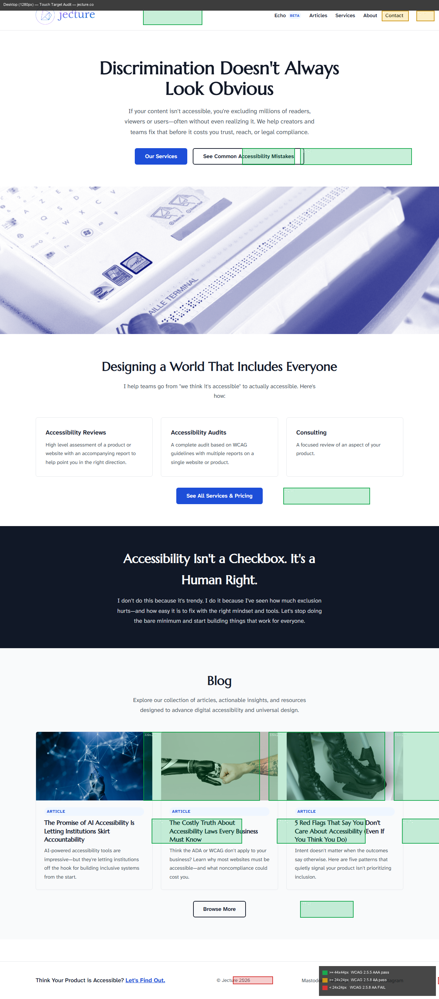 | 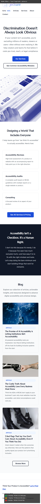 |

### wcag-focus-indicators
| Desktop (1280px) | Mobile (390px) |
|-----------------|----------------|
| 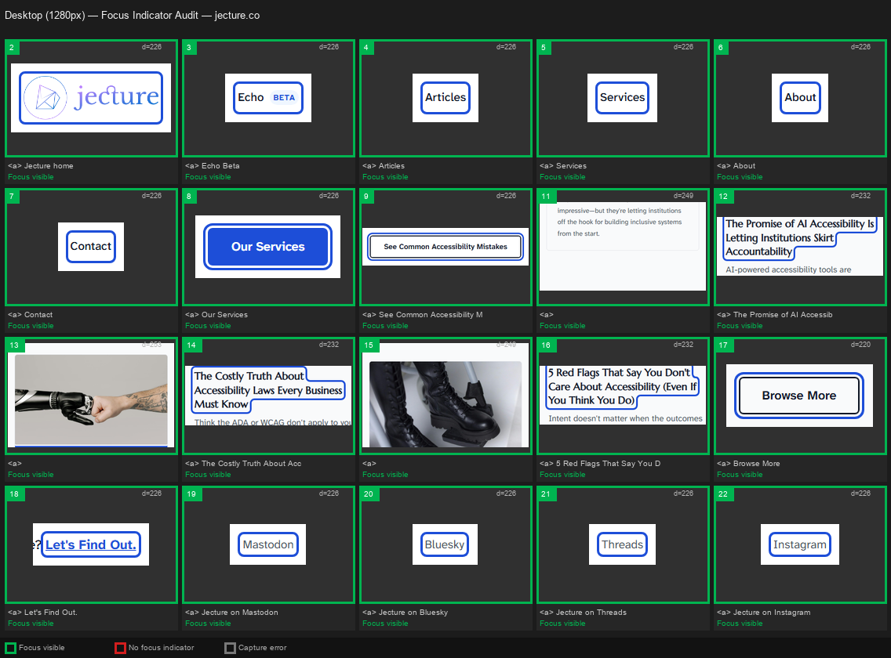 | 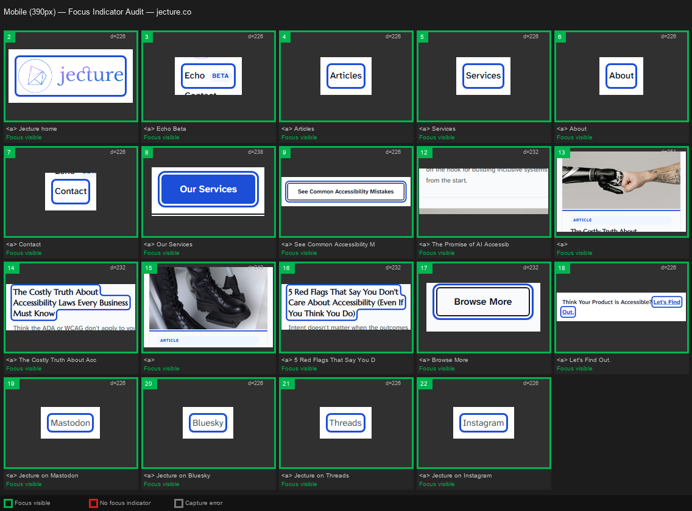 |

### wcag-color-contrast
| Desktop (1280px) | Mobile (390px) |
|-----------------|----------------|
| 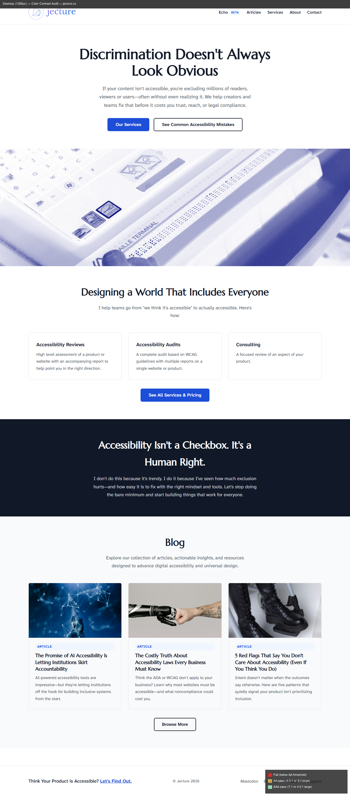 | 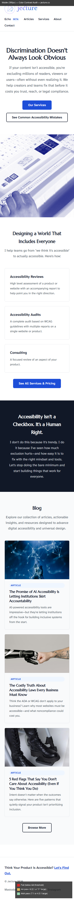 |

### wcag-headings
| Annotated Screenshot | Outline Diagram |
|---------------------|----------------|
| 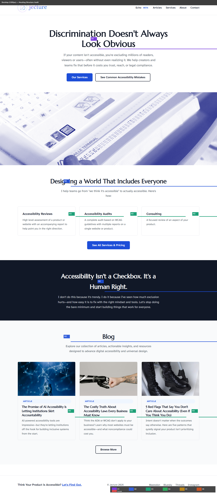 | 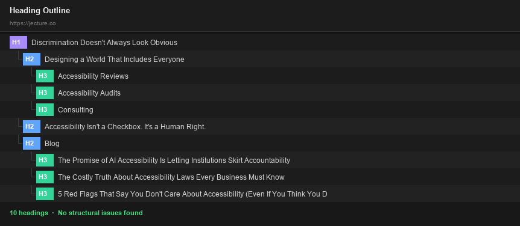 |

### wcag-images
| Desktop contact sheet | Mobile contact sheet |
|----------------------|---------------------|
| 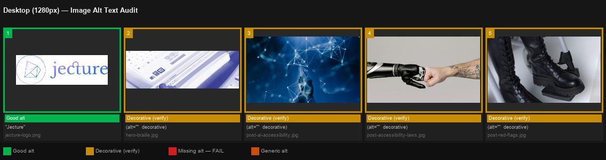 | 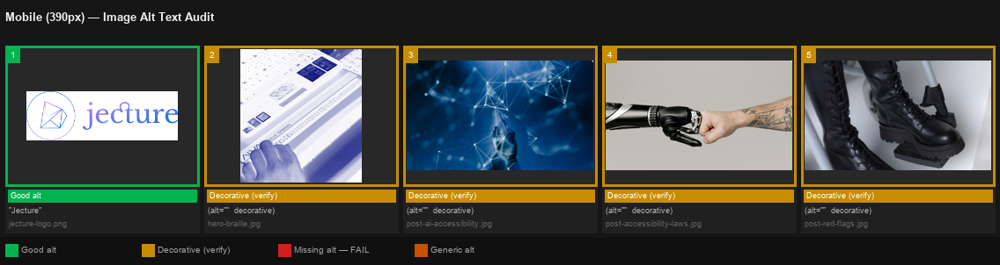 |

### wcag-links
| Desktop (1280px) | Mobile (390px) |
|-----------------|----------------|
|  |  |

### wcag-text-spacing
| Desktop (1280px) | Mobile (390px) |
|-----------------|----------------|
| 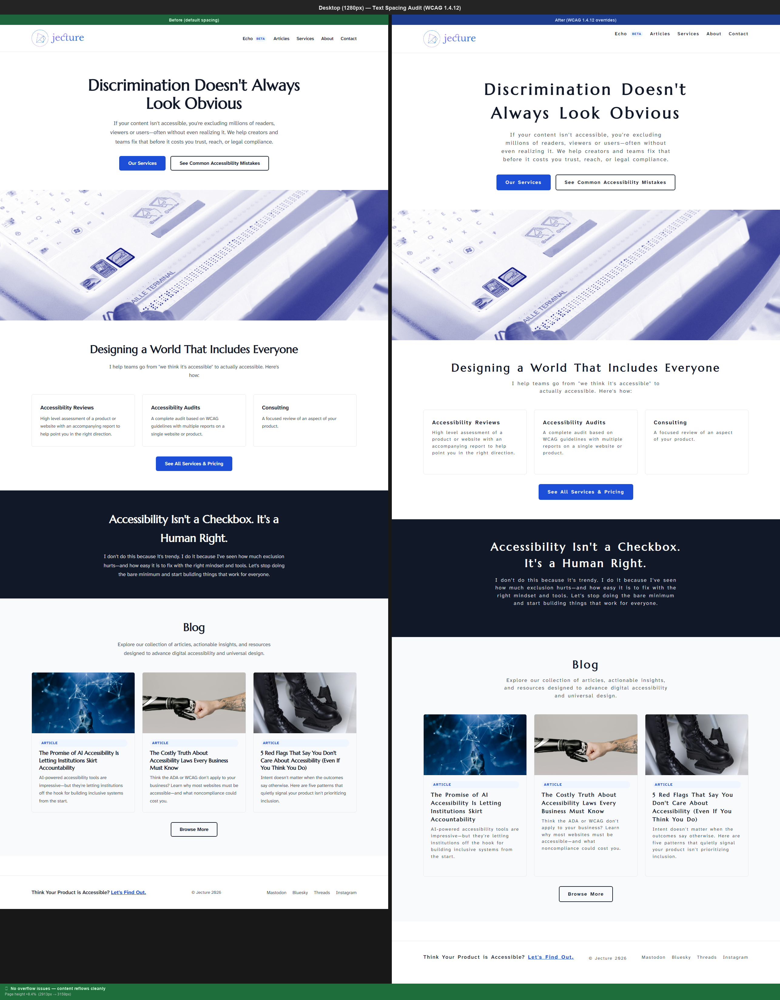 | 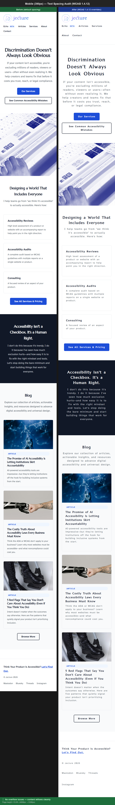 |

### wcag-forms
| Contact page form fields |
|--------------------------|
| 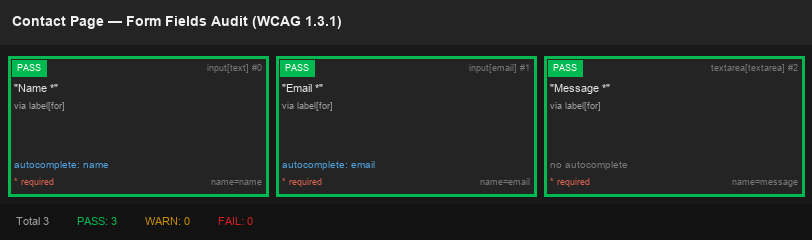 |

### wcag-landmarks
| Desktop (1280px) | Mobile (390px) |
|-----------------|----------------|
|  | 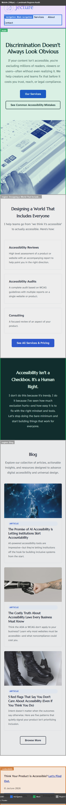 |

### wcag-reflow
| Desktop vs 320px comparison |
|-----------------------------|
| 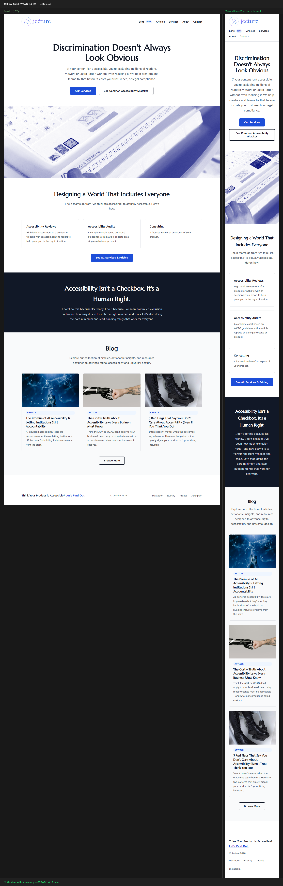 |

---

## Requirements

Before using any skill in this collection you need:

1. **Claude desktop app** — [claude.ai/download](https://claude.ai/download)
2. **Claude in Chrome extension** — Required for browser automation. Install from the Chrome Web Store, then connect it to Claude via Settings → Extensions.
3. **Python 3.9+** with these packages:
   ```bash
   pip install pillow playwright
   python -m playwright install chromium
   ```

---

## Installing

```bash
git clone https://github.com/uxBrad/claude-accessibility-skills.git
```

In Claude settings (Settings → Skills → Add skill folder), add the `skills/` directory from this repo. Claude will detect all skills automatically.

Or copy any individual skill folder to your machine and add that path to Claude's skill settings.

---

## Usage

Once installed, just describe what you want in a Claude conversation:

> *"Audit the keyboard accessibility of https://mysite.com"*
> *"Check touch target sizes on localhost:8080 — desktop and mobile"*
> *"Find any text with low contrast on this page"*
> *"Are there any missing focus indicators on this site?"*
> *"Show me the heading structure of this page"*
> *"Check all images for missing alt text"*
> *"Find any click here or read more links"*
> *"Test text spacing on this page"*
> *"Check all form labels on the checkout page"*
> *"Show me the landmark structure"*
> *"Does this page reflow at 320px?"*
> *"Run a full accessibility audit on https://mysite.com and give me a PDF"*

---

## Repository Structure

```
claude-accessibility-skills/
├── skills/
│   ├── wcag-keyboard/
│   ├── wcag-touch-targets/
│   ├── wcag-focus-indicators/
│   ├── wcag-color-contrast/
│   ├── wcag-full-audit/
│   ├── wcag-headings/
│   ├── wcag-images/
│   ├── wcag-links/
│   ├── wcag-text-spacing/
│   ├── wcag-forms/
│   ├── wcag-landmarks/
│   └── wcag-reflow/
├── examples/
│   └── jecture-co/
│       ├── desktop_heatmap.png
│       ├── mobile_heatmap.png
│       ├── touch-targets/
│       ├── focus-indicators/
│       ├── color-contrast/
│       ├── headings/
│       ├── images/
│       ├── links/
│       ├── text-spacing/
│       ├── forms/
│       ├── landmarks/
│       └── reflow/
└── README.md
```

---

## Contributing

1. Fork this repo and create a branch
2. Create a folder under `skills/your-skill-name/`
3. Write a `SKILL.md` with YAML frontmatter (`name` and `description`) and instructions for Claude
4. Add a `README.md` and example output
5. Open a pull request

**SKILL.md frontmatter:**
```yaml
---
name: your-skill-name
description: 'When to use and what it produces. Be specific about trigger phrases.'
---
```

---

## License

MIT