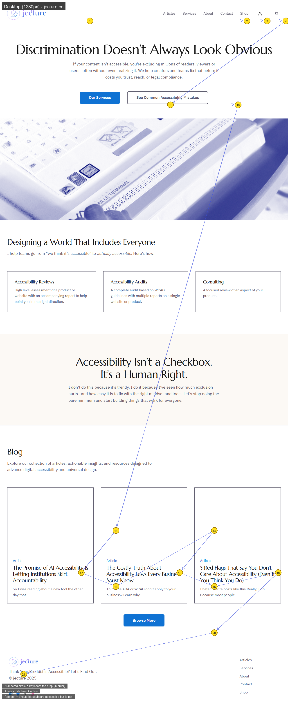
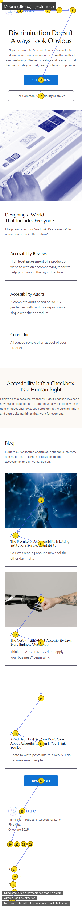

# wcag-keyboard

A Claude skill that audits any website for WCAG 2.1 Keyboard Accessibility and generates a visual heatmap showing the full tab order.

## What it produces

For each URL you give it, the skill generates two annotated images:

- **Desktop heatmap (1280px)** — numbered yellow circles at every focusable element, blue arrows showing the tab flow, red boxes on anything that should be keyboard-accessible but isn't
- **Mobile heatmap (390px)** — the same audit at a mobile viewport, where layout shifts can cause the visual and keyboard order to diverge

It also writes a summary report in the conversation covering total interactive elements, elements missing from the tab order, and a WCAG 2.1 pass/fail table.

## Example output

### Desktop (1280px)



### Mobile (390px)



*Example audit of [jecture.co](https://jecture.co)*

## WCAG criteria covered

| Criterion | Level | What it checks |
|-----------|-------|---------------|
| **2.1.1 Keyboard** | A | All interactive elements reachable and operable by keyboard |
| **2.1.2 No Keyboard Trap** | A | Focus can always move away from any component |
| **2.1.4 Character Key Shortcuts** | A | Single-key shortcuts are controllable |

## How to use

1. Install the skill (see [repo README](../../README.md))
2. In Claude, say something like:
   - *"keyboard audit https://yoursite.com"*
   - *"check tab order on localhost:3000"*
   - *"generate a keyboard heatmap for my app"*
   - *"audit accessibility of https://yoursite.com — desktop and mobile"*

Claude will navigate to the page, collect the full tab order via JavaScript, generate both heatmaps, and report findings.

## Requirements

The skill needs:
- **Claude in Chrome** browser extension (for live page interaction)
- **Python 3.8+** with `Pillow` (`pip install Pillow`)
- **Playwright** for full-page screenshots (`pip install playwright && python -m playwright install chromium`)

## Scripts

| Script | Purpose |
|--------|---------|
| `scripts/heatmap.py` | Composites the annotated heatmap image from a screenshot + element JSON |
| `scripts/capture.py` | Full-page screenshot using Playwright (desktop or mobile viewport) |

### Run heatmap manually

If you have element data and a screenshot already, you can generate the heatmap directly:

```bash
python scripts/heatmap.py \
  --screenshot page.png \
  --elements elements.json \
  --missing missing.json \
  --output heatmap.png \
  --label "Desktop (1280px)"
```

**`elements.json`** — array of focusable elements with positions:
```json
[
  { "tabOrder": 1, "tag": "a", "label": "Home", "x": 120, "y": 80, "w": 60, "h": 24 },
  { "tabOrder": 2, "tag": "button", "label": "Sign in", "x": 900, "y": 80, "w": 90, "h": 36 }
]
```

**`missing.json`** — array of elements that should be keyboard-accessible but aren't:
```json
[
  { "tag": "div", "label": "Save changes", "x": 400, "y": 300, "w": 120, "h": 40 }
]
```

### Capture a full-page screenshot

```bash
python scripts/capture.py --url https://example.com --outdir ./output --viewport desktop
python scripts/capture.py --url https://example.com --outdir ./output --viewport mobile
```

## Heatmap legend

| Visual | Meaning |
|--------|---------|
| Numbered yellow circle | Keyboard tab stop — number = position in tab order |
| Blue arrow | Tab flow direction between stops |
| Red outlined box | Element that should be keyboard-accessible but cannot be reached by Tab |