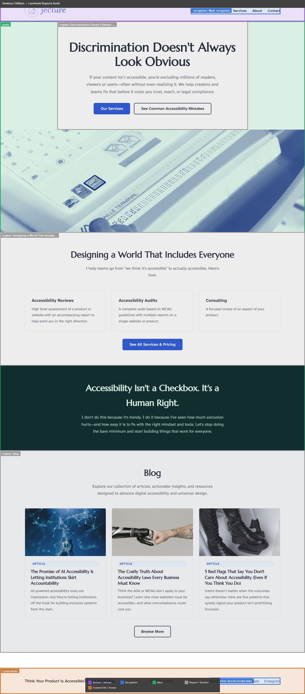

# wcag-landmarks

Audits page landmark regions and generates an annotated screenshot showing every landmark element color-coded by role. Screen reader users navigate pages by jumping between landmarks — missing or duplicate landmarks make orientation much harder.

## WCAG Coverage

| Criterion | Level | Requirement |
|-----------|-------|-------------|
| 1.3.6 Identify Purpose | AAA | Purpose of UI components can be programmatically determined |
| 2.4.1 Bypass Blocks | A | A mechanism exists to bypass blocks of content repeated on multiple pages |

## What it produces

- **Desktop annotated screenshot** and **Mobile annotated screenshot**
- Semi-transparent colored overlay on each landmark region with a role badge
- Legend at the bottom showing only the roles present on the page
- Console output listing all landmarks found with dimensions and accessible names

## Landmark roles and colors

| Role | Color | HTML element |
|------|-------|-------------|
| `banner` | Purple | `<header>` |
| `navigation` | Blue | `<nav>` |
| `main` | Green | `<main>` |
| `complementary` | Teal | `<aside>` |
| `contentinfo` | Orange | `<footer>` |
| `search` | Yellow | `<form role="search">` |
| `form` | Red | `<form>` with accessible name |
| `region` | Grey | `<section>` with accessible name |

## Issues detected

- Missing `main` landmark → FAIL (screen reader users cannot jump to main content)
- Multiple `main` landmarks → FAIL
- Multiple `nav` elements without accessible names → WARN (indistinguishable in landmark list)
- Missing `banner` or `contentinfo` → WARN
- No skip link to `main` → WARN (alternative to landmark navigation)

## Example prompts

- *"Show me the landmark structure of https://example.com"*
- *"Check if this page has a main landmark"*
- *"Are there any navigation landmarks without accessible names?"*
- *"Run a WCAG 2.4.1 audit on this page"*
- *"Find missing page regions on localhost:3000"*

## Requirements

- Claude desktop app with Chrome extension connected
- Python 3.9+ with `pip install pillow playwright`
- `python -m playwright install chromium`

## Scripts

| Script | Purpose |
|--------|---------|
| `scripts/capture.py` | Playwright: full-page screenshot |
| `scripts/landmark_overlay.py` | PIL: colored overlays on screenshot |

### landmark_overlay.py CLI

```bash
python scripts/landmark_overlay.py \
  --screenshot path/to/screenshot.png \
  --landmarks  path/to/landmarks.json \
  --output     path/to/output.png \
  --label      "Desktop (1280px) — Landmark Regions Audit"
```

### landmarks.json format

```json
[
  {
    "index": 0,
    "tag": "header",
    "role": "banner",
    "accessible_name": "",
    "x": 0, "y": 0, "w": 1280, "h": 89
  },
  {
    "index": 1,
    "tag": "nav",
    "role": "navigation",
    "accessible_name": "Main navigation",
    "x": 452, "y": 30, "w": 376, "h": 29
  }
]
```

## Common fixes

| Issue | Fix |
|-------|-----|
| Missing main landmark | Wrap main content in `<main>` or add `role="main"` |
| Multiple unlabelled navs | Add `aria-label="Primary navigation"`, `aria-label="Breadcrumbs"` etc. |
| No skip link | Add `<a href="#main-content" class="skip-link">Skip to main content</a>` before the header |
| No `<section>` accessible name | Add `aria-label` or `aria-labelledby` (otherwise it won't be treated as a landmark) |

## Example output — jecture.co

**Result:** ✓ Clean landmark structure — `banner`, `main`, `contentinfo` all present. Two `nav` elements both have accessible names ("Main navigation" and "Social media links"). Named `section` elements used for page regions.

| Desktop landmark overlay | Mobile landmark overlay |
|------------------------|------------------------|
|  |  |
