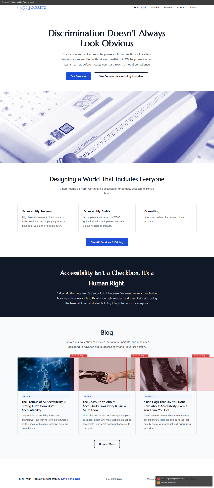
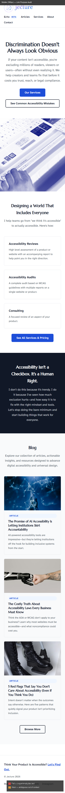

# wcag-links

Audits all links on a page for meaningful, descriptive text and generates an annotated screenshot highlighting vague, empty, or ambiguous link text.

## WCAG Coverage

| Criterion | Level | Requirement |
|-----------|-------|-------------|
| 2.4.4 Link Purpose (In Context) | AA | Link purpose determinable from text alone or text + context |
| 2.4.9 Link Purpose (Link Only) | AAA | Link purpose determinable from link text alone |

## What it produces

- **Desktop annotated screenshot** and **Mobile annotated screenshot**
- Red badge on every failing link showing the flag type and link text
- Orange badge on links that are ambiguous but may be OK in context
- Console output listing all flagged links with suggested fixes

## Flag categories

| Flag | Severity | Examples |
|------|----------|---------|
| `vague` | Fail | "click here", "here", "read more", "learn more", "this", "go" |
| `empty` | Fail | Icon-only link with no text and no `aria-label` |
| `url` | Fail | Link text is a raw URL |
| `short` | Fail | 1–3 character text that isn't meaningful (">", "»") |
| `generic` | Warn | "more", "view", "see", "details" — ambiguous out of context |

## Example prompts

- *"Find all the vague links on https://example.com"*
- *"Check for click here and read more links on this page"*
- *"Are there any icon-only links without aria-labels on localhost:3000?"*
- *"Run a WCAG 2.4.4 link text audit"*

## Requirements

- Claude desktop app with Chrome extension connected
- Python 3.9+ with `pip install pillow playwright`
- `python -m playwright install chromium`

## Scripts

| Script | Purpose |
|--------|---------|
| `scripts/capture.py` | Full-page screenshot via Playwright |
| `scripts/link_overlay.py` | Classifies links and draws badges on screenshot |

### link_overlay.py CLI

```bash
python scripts/link_overlay.py \
  --screenshot path/to/screenshot.png \
  --links      path/to/links.json \
  --output     path/to/output.png \
  --label      "Desktop (1280px)"
```

The script will classify any links not already classified in the JSON.

### links.json format

```json
[
  {
    "index": 5,
    "tag": "a",
    "text": "click here",
    "aria_label": "",
    "href": "/contact",
    "x": 340, "y": 820, "w": 80, "h": 24,
    "flag": "vague"
  }
]
```

## Common fixes

| Issue | Fix |
|-------|-----|
| "Read more" links | Add `aria-label="Read more about [article title]"` |
| Icon-only links | Add `aria-label="[Destination or action]"` to the `<a>` element |
| "Click here" | Rewrite surrounding sentence so link text is naturally descriptive |
| Raw URL as text | Replace with a human-readable description of the destination |

## Example output — jecture.co

**Result:** 22 links audited · 3 fail (empty — blog card image links with no text or aria-label) · 0 warn · 19 pass

| Desktop audit | Mobile audit |
|---|---|
|  |  |

The three failing links are `<a href="..."></a>` blog card thumbnail wrappers — they have no text content and no `aria-label`, making them invisible to screen readers navigating by links. Fix: add `aria-label="Read article: [title]"` to each anchor.
